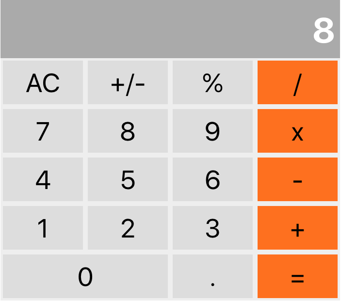

# React Calculator

Live: [react-calculator](https://basic-react-calc.herokuapp.com/)

## Purpose

Refamiliarize myself with react and create something practical which I would actually use. Additionally, I made use of [big-js](https://www.npmjs.com/package/big-js) to deal with very large values and [styled-components](https://www.npmjs.com/package/styled-components) to style the components.

This calculator supports +, -, /, and x operations. Additionally, clear, percentage, and negation options are included. The ui is designed to closely resemble MacOS's basic calculator.

## Preview

## Setup
1. Clone this repository
2. cd into it
2. `yarn` to download dependencies
4. `yarn start`
5. Open [http://localhost:3000](http://localhost:3000) to view it in the browser.
